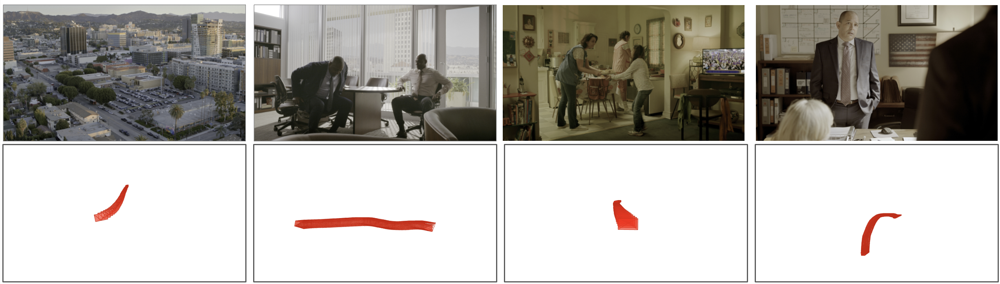

## Small-Baseline Camera-Tracking Dataset



We present the Small-Baseline Camera-Tracking dataset which is used as the evaluation dataset (StudioSfM) in the following paper:

<em>Depth-Guided Sparse Structure-from-Motion for Movies and TV Shows</em>. Sheng Liu, Xiaohan Nie, Raffay Hamid, IEEE CVPR 2022


This dataset contains 130 video shots collected from 15 TV episodes from Amazon Prime Video. Each shot is annotated with corresponding camera motion data by a professional CG studio. This dataset aims to faciliate the research of 3D reconstruction for small-baseline videos in movies and TV shows.

### Annotation

In the folder of each video, the camera motion data is stored as a dictionary in 'camera.pkl' file which can be loaded using pickle package with Python 3.7. 

The key of the dictionary is the image id which corresponds to image name, and the value is also a dictionary with 'intr_mtx' stores the camera intrinsics and 'v2c' stores the world to camera transformation. 

### How to request the download link
Please contact shenlu *at* amazon.com to request the download link of the full dataset. 

## License

This repository is licensed under the CC-BY-NC 4.0 License.

## Citation

If you use this dataset, please cite the following paper:

```
@inproceedings{pv-2022-sfm,
    title = "Depth-Guided Sparse Structure-from-Motion for Movies and TV Shows",
    author = "Sheng Liu  and
      Xiaohan Nie  and
      Raffay Hamid",
    booktitle = "The Conference on Computer Vision and Pattern Recognition",
    year = "2022",
}
```
